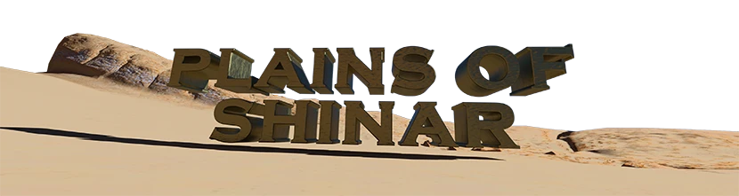

A 2D Action RPG (ARPG) made with [MonoGame](https://www.monogame.net/). A port of [DaggerQuest](https://DaggerQuest.com).

## 🎮 Features

- **Cross-Platform**: Runs on Windows, Mac, Linux, and more platforms supported by MonoGame
- **Isometric 2D Graphics**: Beautiful isometric perspective with dynamic camera angles
- **Character Animation System**: Comprehensive sprite-based animations for player actions
- **Entity Management**: Modular entity system with collision detection and pathfinding
- **High Performance**: Native performance with hardware-accelerated graphics
- **Content Pipeline**: Optimized asset management using MonoGame Content Pipeline

## 🚀 Getting Started

### Prerequisites

- [.NET 8.0 SDK](https://dotnet.microsoft.com/download/dotnet/8.0) or later
- [MonoGame](https://www.monogame.net/) (automatically installed via NuGet)
- Visual Studio 2022, Visual Studio Code, or any .NET-compatible IDE

### Installation

1. Clone the repository:
```bash
git clone https://github.com/Laserwolve-Games/PlainsOfShinar.git
cd PlainsOfShinar
```

2. Restore dependencies and build the project:
```bash
dotnet restore
dotnet build
```

3. Run the game:
```bash
dotnet run
```

## 🎯 Gameplay

Plains of Shinar features classic ARPG gameplay elements:

- **Movement**: Navigate through the isometric world using keyboard or gamepad
- **Combat**: Multiple attack animations including slashes, kicks, and ground slams
- **Character States**: Idle, walking, blocking, and various combat animations
- **Dynamic Shadows**: Real-time shadow rendering for immersive gameplay
- **Inventory System**: Collect and manage weapons, armor, and items
- **Skills & Abilities**: Character progression and customization

## 🏗️ Architecture

### Core Components

- **`Game1.cs`**: Main game class inheriting from MonoGame's Game class
- **`Program.cs`**: Entry point for the application
- **Content Pipeline**: Asset management through MonoGame's content pipeline
- **Entity System**: Component-based entity management
- **Rendering System**: Sprite-based rendering with isometric projection

### Project Structure

```
PlainsOfShinar/
├── Game1.cs              # Main game class
├── Program.cs             # Application entry point
├── PlainsOfShinar.csproj  # Project file
├── Content/               # Game assets (textures, sounds, etc.)
├── bin/                   # Compiled binaries
└── obj/                   # Build artifacts
```

### Key Features

- **MonoGame Framework**: Built on the robust MonoGame framework
- **Cross-Platform**: Supports Windows, macOS, Linux, and more
- **Content Pipeline**: Optimized asset loading and management
- **Hardware Acceleration**: Leverages GPU for optimal performance
- **Component Architecture**: Modular, maintainable code structure

## 🎨 Assets

The game includes comprehensive sprite sheets for character animations:

- **Idle**: Breathing and standing animations
- **Movement**: Walking animations with directional support
- **Combat**: Multiple attack types (upward slash, downward slash, kicks, ground slam)
- **Reactions**: Hit reactions, blocking, death animations
- **Special**: War cry and other special animations

Assets are processed through MonoGame's Content Pipeline for optimal performance and cross-platform compatibility.

## 🔧 Development

### Building the Project

```bash
# Build the project
dotnet build

# Run the project
dotnet run

# Publish for distribution
dotnet publish -c Release
```

### Available Tasks

The project includes several predefined tasks:
- **Build**: Compile the project (`dotnet build`)
- **Publish**: Create distribution packages (`dotnet publish`)
- **Watch**: Run with hot reload for development (`dotnet watch run`)

### Configuration

Key configuration is managed through:
- **`PlainsOfShinar.csproj`**: Project settings and dependencies
- **`Content/Content.mgcb`**: Content pipeline configuration
- **`app.manifest`**: Application manifest for Windows

## 🤝 Contributing

Contributions are welcome! Please feel free to submit a Pull Request. For major changes, please open an issue first to discuss what you would like to change.

### Development Guidelines

1. Follow C# coding conventions and best practices
2. Use the existing project structure and architecture
3. Test your changes thoroughly across different platforms
4. Update documentation as needed
5. Ensure compatibility with MonoGame framework standards

### Setting Up Development Environment

1. Install [.NET 8.0 SDK](https://dotnet.microsoft.com/download/dotnet/8.0)
2. Clone the repository
3. Run `dotnet restore` to install dependencies
4. Open in your preferred IDE (Visual Studio, VS Code, JetBrains Rider)

## 📝 License

This project is licensed under the [AGPL 3.0 License](https://www.gnu.org/licenses/agpl-3.0.html.en) - see the [LICENSE](LICENSE) file for details.

## 🎖️ Acknowledgments

- Built with [MonoGame](https://www.monogame.net/)
- Inspired by classic isometric ARPGs
- Part of the [Laserwolve Games](https://www.laserwolvegames.com/) portfolio
- Special thanks to the MonoGame community
